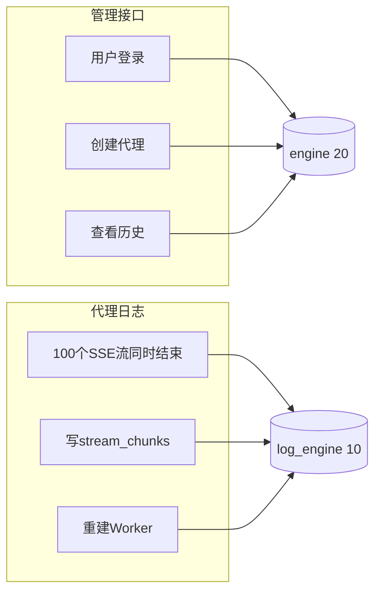

# LLM Proxy — 智能体与大模型 API 通信拦截记录系统

截获和记录智能体与大模型 API 之间 HTTP 通信的代理系统。支持流式/非流式请求、SSE 重组为完整 JSON、JSON 树形查看、实时刷新、多用户隔离。

## 目录

- [核心设计](#核心设计)
- [完整数据流](#完整数据流)
- [数据模型](#数据模型)
- [安全设计](#安全设计)
- [高并发设计](#高并发设计)
- [SSE 流式处理](#sse-流式处理)
- [部署方式](#部署方式)
- [API 接口](#api-接口)
- [环境变量](#环境变量)

## 核心设计

### 共享代理（Shared Proxy）

整个系统只监听一个 TCP 端口（默认 3998），通过 URL 路径中的代理编号区分不同用户：

```
智能体请求 → http://server:3998/12345/v1/chat/completions
                            ↑
                    5 位随机编号（10000–99999）
```

| 特性 | 实现 |
|------|------|
| 编号 | 5 位随机数，系统分配，永不冲突 |
| 服务器 | 单进程 FastAPI + asyncio，一个端口处理千级并发 |
| 配置存储 | MySQL，所有状态持久化，内存缓存 + TTL 加速 |
| 安全 | JWT 认证 + bcrypt + SSRF 防护 + CORS |
| 流式处理 | Write-Ahead 逐 chunk 写 MySQL，后台 Worker 异步重建 JSON |

### 路由优先级

```
/api/*           → 管理接口（认证、端口 CRUD、历史查询）
/{port_number}/* → 共享代理端点（转发到目标 LLM API）
```

FastAPI 先注册 `/api/*` 路由，后注册 `/{port_number}/*`，确保管理接口优先匹配。

## 完整数据流

### 1. 用户注册与审批

```
用户提交注册 → POST /api/auth/register
    → User 写入 users 表（is_approved=False）
    → 前端提示"等待管理员审批"

管理员登录 → Admin 页面 → 点击"批准"
    → PUT /api/admin/users/approve {user_id, is_approved: true}
    → User.is_approved = True
    → 用户可登录
```

### 2. 代理创建

```
用户登录 → Dashboard → 点击"创建代理" → 输入目标地址

POST /api/ports {target_url, description}
    │
    ├─ 1. require_approved → JWT Bearer Token 验证身份
    ├─ 2. _validate_target_url() → SSRF 检查
    │       • 阻止 http/https 以外的 scheme
    │       • 阻止 localhost / metadata.google.internal
    │       • ALLOW_INTERNAL_TARGETS=false 时阻止私有 IP
    ├─ 3. SELECT GET_LOCK('llm_proxy_port_alloc', 10)
    │       → MySQL 命名锁，序列化端口分配，多进程安全
    ├─ 4. 生成随机 5 位数（10000–99999），与已有编号去重
    ├─ 5. INSERT INTO ports (port_number, user_id, target_url, ...)
    ├─ 6. SELECT RELEASE_LOCK('llm_proxy_port_alloc')
    └─ 7. refresh_port_cache() → 更新内存缓存，新端口立即可用
```

### 3. 代理转发（非流式）

```
智能体 → POST http://server:3998/12345/v1/chat/completions
    │
    ├─ 1. aget_target_url(12345) → 异步查缓存/DB，不阻塞事件循环
    │       • 快速路径：内存缓存命中（微秒级）
    │       • 慢速路径：run_in_executor 查 DB（线程池，不阻塞 asyncio）
    │
    ├─ 2. 请求体 → SpooledTemporaryFile（≤10MB 内存，>10MB 溢写磁盘）
    │
    ├─ 3. 请求头处理：移除 host/content-length/connection 等，
    │       设置 target host，移除 accept-encoding
    │
    ├─ 4. httpx 共享连接池 → 转发到目标 LLM API
    │       • 超时：连接 15s，总请求 300s
    │       • 连接池：最大 200 连接，50 keep-alive
    │
    ├─ 5. 非流式响应 → SpooledTemporaryFile 累积 → 返回客户端
    │
    └─ 6. asyncio.create_task(_save_record_async) → 后台写 requests 表
            ↓
        专用线程池 (_db_executor) → 专用 DB 连接池 (LogSessionLocal)
            ↓
        重试 3 次（0.5s / 1.0s 退避）
```

### 4. 代理转发（流式 SSE — Write-Ahead 架构）

```
智能体 → POST http://server:3998/12345/v1/chat/completions
    │
    ├─ 1-3. 同上（缓存查找、请求体处理、头处理）
    │
    ├─ 4. 检测到响应 Content-Type: text/event-stream
    │
    ├─ 5. INSERT INTO stream_sessions  ← 元数据（method, path, headers...）
    │
    ├─ 6. 逐 chunk 处理：
    │       chunk → yield 给客户端（立即，不等待）
    │       chunk → asyncio.create_task → INSERT stream_chunks(seq=N)
    │       │
    │       └─ 所有 chunk 的 INSERT 在后台并行执行
    │          完成后 await asyncio.wait() 确保全部落库
    │
    ├─ 7. UPDATE stream_sessions SET is_complete=1  ← 通知 Worker
    │
    └─ 后台 Worker（每 5 秒轮询）：
            │
            ├─ SELECT * FROM stream_sessions
            │   WHERE is_complete=1 AND is_processed=0 LIMIT 10
            │
            ├─ SELECT * FROM stream_chunks
            │   WHERE stream_id=X ORDER BY seq
            │
            ├─ b"".join(chunks) → raw_sse_text → response_body_raw
            │
            ├─ _reconstruct_sse_to_json(raw_sse_text)
            │   ├─ 自动检测格式 (Anthropic / OpenAI / Gemini / 通用)
            │   ├─ 成功 → response_body = 重建 JSON
            │   └─ 失败 → response_body = raw_sse_text, reconstruction_error=1
            │
            ├─ INSERT INTO requests (...)  ← 最终记录
            ├─ DELETE FROM stream_chunks WHERE stream_id=X  ← 释放空间
            └─ DELETE FROM stream_sessions WHERE stream_id=X
```

### 5. 数据入库（关键保证）

每条交互记录最终都进入 `requests` 表，含以下字段：

| 字段 | 非流式 | 流式 |
|------|:--:|:--:|
| `port_id` | port.id 或 NULL | port.id 或 NULL（端口删除后仍保存） |
| `method` / `path` | ✅ | ✅ |
| `request_headers` / `request_body` | ✅ | ✅ |
| `response_headers` | ✅ | ✅ |
| `response_body` | JSON | 重建 JSON（失败时回退为原始文本） |
| `response_body_raw` | 同 response_body | 完整原始 SSE 文本 |
| `status_code` | ✅ | ✅ |
| `duration_ms` | ✅ | ✅ |
| `reconstruction_error` | 始终 False | True = 重建失败（前端展示警告） |

数据不丢失保证：

- 端口被删除 → 记录仍写入，`port_id=NULL`
- SSE 重建失败 → `response_body_raw` 保留原始数据，`reconstruction_error=True`
- DB 写入失败 → 3 次重试
- Worker 异常 → 兜底逻辑直接保存原始 SSE 文本

### 6. 代理端口生命周期

```
用户创建 → [运行中] ←→ 停用
                │
                ├─ 编辑（修改目标地址/描述/编号）
                │
                └─ 软删除 → [已删除，数据保留]
                              │
                              ├─ 恢复 → [运行中]
                              └─ 彻底删除 → 数据永久清除
```

**软删除机制**：删除端口时仅设置 `deleted_at` 时间戳和 `is_active=False`，不删除数据库记录。管理员可在「已删除代理」页面查看、恢复或彻底删除。软删除期间产生的交互记录仍写入 `requests` 表（`port_id=NULL`），数据不会丢失。

**停用 vs 软删除**：停用只是 `is_active=False`，代理编号保留且可重新启用。软删除后代理从缓存移除，编号不可再用。

## 数据模型

```
users                        ports                       requests
┌──────────────┐            ┌──────────────────┐        ┌──────────────────────┐
│ id (PK)      │──┐         │ id (PK)          │──┐     │ id (PK)              │
│ username     │  │         │ port_number (UQ) │  │     │ port_id (FK→ports)   │
│ password_hash│  │ 1:N     │ user_id (FK)     │←─┘     │ method               │
│ role         │──┘         │ target_url       │ 1:N    │ path                 │
│ is_approved  │            │ description      │────────│ request_headers      │
│ created_at   │            │ is_active        │        │ request_body         │
└──────────────┘            │ deleted_at       │        │ response_headers     │
                            │ created_at       │        │ response_body        │
                            └──────────────────┘        │ response_body_raw    │
                                                        │ status_code          │
stream_sessions               stream_chunks             │ duration_ms          │
┌──────────────────┐         ┌──────────────────┐       │ reconstruction_error │
│ id (PK)          │──┐      │ id (PK)          │       │ created_at           │
│ stream_id (UQ)   │  │ 1:N  │ stream_id (FK)   │       └──────────────────────┘
│ port_number      │──┘      │ seq              │
│ method           │         │ chunk_data       │
│ path             │         └──────────────────┘
│ request_headers  │
│ request_body     │         stream_sessions + stream_chunks 是 Write-Ahead 临时表
│ response_headers │         Worker 重建后自动清理
│ status_code      │
│ is_complete      │
│ is_processed     │
│ error_message    │
└──────────────────┘
```

## 安全设计

| 层面 | 措施 | 实现 |
|------|------|------|
| 身份认证 | JWT (HS256) | Bearer Token，7 天过期 |
| 密码存储 | bcrypt | 72 字节截断 + 随机盐 |
| 用户审批 | is_approved 标记 | 新用户注册后需管理员审批 |
| 权限控制 | role (admin/user) | 依赖注入 require_admin / require_approved |
| SSRF 防护 | URL 校验 | 阻止内网 IP / localhost / metadata 端点 |
| CORS | FastAPI Middleware | 可配置来源白名单 |
| 端口分配锁 | MySQL GET_LOCK | 序列化分配，防止编号冲突 |
| API Key | 透传不存储 | 代理不记录 Authorization 头 |

## 高并发设计

### 瓶颈分析与缓解

| 瓶颈点 | 方案 | 参数 |
|--------|------|------|
| 事件循环阻塞 | 所有 DB 查询在线程池执行 | `run_in_executor(_db_executor)` |
| 管理接口 vs 日志争抢 | 双 DB 连接池完全隔离 | 管理池 20+40 / 日志池 10+20 |
| 线程池争抢 | 代理日志使用专用线程池 | `DB_SAVE_WORKERS=8` |
| 上游连接数 | httpx 共享连接池 | 200 总连接 / 50 keep-alive |
| 端口查找 | 内存缓存 + TTL | 5 秒过期，缓存命中率 99.9%+ |
| 请求体 OOM | SpooledTemporaryFile | ≤10MB 内存，>10MB 溢写磁盘 |
| 流式内存累积 | Write-Ahead 逐 chunk 写 MySQL | 代理进程零内存/零磁盘累积 |
| 流式重建 | 后台 Worker 异步处理 | 每 5 秒批处理 10 条 |

### 为什么不需要多进程

| 原因 | 说明 |
|------|------|
| I/O 密集型 | 代理转发 90%+ 时间在 await（等待网络），CPU 利用率 <5% |
| asyncio 协程 | 单线程调度数千协程，每个协程切换开销微秒级 |
| 阻塞操作已隔离 | DB 写入、SSE 解析全部放到专用线程池 |
| 真正瓶颈在上游 | OpenAI 的生成速度（秒级）远超代理转发开销（微秒级） |

如需高可用，应使用多容器 + 负载均衡，而非单机多进程。

## SSE 流式处理

### 格式支持

| API | 检测标志 | 解析方式 |
|-----|----------|----------|
| OpenAI Chat Completions | `choices[].delta` | 逐 chunk 累积 content + tool_calls |
| OpenAI Responses | `type` 以 `response.` 开头 | 按事件类型累积 output_text / reasoning |
| Anthropic Messages | `type` 为已知事件名 | 按 content_block 索引累积 text / thinking / tool_use |
| Google Gemini | `candidates[]` 存在 | 累积 parts[].text |
| 通用/未知 | 以上均不匹配 | 深度合并 + content 字段提取 + 递归遍历 |

### Write-Ahead 时序保证

```
yield chunk → create_task(INSERT stream_chunks) → pending_tasks.add(task)
...
async for 退出 → await asyncio.wait(pending_tasks)  ← 确保所有 INSERT 完成
              → create_task(UPDATE is_complete=1)  ← 通知 Worker
```

`asyncio.wait(pending_tasks)` 保证 Worker 永远不会看到不完整的 chunk 集合。

### 重建 Worker 设计

流式 SSE 的重建由一个后台 asyncio task 负责，运行在 FastAPI 的 lifespan 内。

**为什么要单独的 Worker？**

代理进程的核心职责是实时透传——收到 chunk 立即 `yield`，不能停顿。而 SSE 重建（拼接所有 chunk、JSON 解析、写入 `requests` 表）是重操作，必须和转发异步解耦。

**Worker 生命周期**

```
FastAPI startup
    │
    └─ asyncio.create_task(stream_reconstruction_worker(5))
            │
            └─ while True:
                │
                ├─ loop.run_in_executor(_db_executor, _process_completed_streams)
                │       │
                │       ├─ SELECT is_complete=1 AND is_processed=0 LIMIT 10
                │       ├─ 对每个 session：
                │       │   ├─ GET_LOCK('recon_{stream_id}', 0)  ← 多机互斥
                │       │   ├─ SELECT * FROM stream_chunks ORDER BY seq
                │       │   ├─ b"".join(chunks) → _reconstruct_sse_to_json()
                │       │   ├─ INSERT INTO requests
                │       │   ├─ DELETE FROM stream_chunks
                │       │   ├─ DELETE FROM stream_sessions
                │       │   └─ RELEASE_LOCK
                │       └─ 重建失败 → 兜底保存 raw_sse_text + error_message
                │
                └─ await asyncio.sleep(5)  ← 下一次轮询
```

**为什么 Worker 也跑在 `_db_executor` 线程池里？**

SSE 解析（`_reconstruct_sse_to_json`）和 `b"".join(chunks)` 都是同步 CPU 操作。直接放在 asyncio 协程中会阻塞事件循环。所以整个 `_process_completed_streams` 通过 `run_in_executor` 投递到专用线程池。

**多机互斥**

多个代理实例各有一个 Worker，通过 MySQL 命名锁 `GET_LOCK('recon_{stream_id}', 0)` 互斥。参数 `0` 表示不等待，拿不到锁直接跳过，保证同一个 stream 不会被两个 Worker 重复处理。

### 数据库连接池设计

整个系统使用 **两套独立的 SQLAlchemy 连接池**：

```
┌─ engine (DB_POOL_SIZE=20, DB_MAX_OVERFLOW=40)
│   连接同一个 MySQL
│   用途：FastAPI 管理路由 → 用户登录、端口 CRUD、历史查询
│   调用方：浏览器触发的 /api/* 请求
│
└─ _log_engine (DB_LOG_POOL_SIZE=10, DB_LOG_MAX_OVERFLOW=20)
    连接同一个 MySQL
    用途：代理日志写入 → 写 requests、stream_chunks、stream_sessions
    调用方：代理转发线程 + 重建 Worker
```

**为什么要两套？**



如果共用一套连接池，100 个 SSE 流同时结束的瞬间——每个流一次 `INSERT stream_chunks` + `UPDATE is_complete`——会瞬间耗尽池中所有连接。此时管理员尝试登录，发现**无连接可用**，只能排队等 30 秒超时。两套池完全隔离后，日志写入再繁忙，管理接口始终有 20 个空闲连接待命。

**日志专用线程池**

代理日志写入（`_save_to_db`、`_insert_chunk_async` 等）使用 `database._db_executor`（`DB_SAVE_WORKERS=8` 个线程），而非 asyncio 的默认线程池。这样日志写入任务之间互不争抢，且不会占满 asyncio 默认线程池影响其他操作。

### 请求头转发规则

代理转发到上游 LLM API 时，以下请求头会被**移除**：

| 移除的头 | 原因 |
|----------|------|
| `host` | 替换为目标 API 的 host（如 `api.openai.com`） |
| `content-length` | httpx 自动计算，手动传递可能不匹配 |
| `connection` | httpx 自行管理 keep-alive |
| `transfer-encoding` | httpx 自行处理分块传输 |
| `content-encoding` | httpx 自动解压响应，无需透传 |
| `accept-encoding` | 显式移除，避免上游返回压缩内容 |

`Authorization` 头（API Key）**原样透传**，代理不存储也不修改。

## 部署方式

### 开发模式

#### 前置条件

- Python 3.14（推荐 `conda activate py314`）
- Node.js 18+
- MySQL 8.0+（远端或本地均可）

#### 1. 克隆项目

```bash
git clone https://github.com/HaoCheng-Wang/llm-proxy.git
cd llm-proxy
```

#### 2. 配置环境变量

```bash
cp .env.example .env
vim .env
```

所有配置项的详细说明见 `.env.example` 中的注释。

> 数据库和表会在后端首次启动时自动创建。

#### 3. 安装后端依赖

选择以下任一方式：

**方式 A：用自己的 Python 3.14 环境（conda）**

```bash
conda activate py314
pip install -r backend/requirements.txt
```

**方式 B：用 uv 创建隔离的虚拟环境**

```bash
# uv 会自动下载或复用你已有的 Python 3.14
#   Linux/macOS: curl -LsSf https://astral.sh/uv/install.sh | sh
#   Windows:     powershell -c "irm https://astral.sh/uv/install.ps1 | iex"
uv sync
```

> `uv sync` 在项目根目录创建 `.venv/`，里面包含所有依赖。

#### 4. 启动后端（终端 1）

```bash
# 方式 A（conda 环境）
nohup python backend/main.py > back.log 2>&1 & echo $! > back.pid

# 方式 B（uv 环境）
nohup uv run python backend/main.py > back.log 2>&1 & echo $! > back.pid
```

> 后端以后台方式运行，日志输出到 `back.log`。查看日志：`tail -f back.log`，停止：`kill $(cat back.pid)`

输出示例：
```
[Main] Running schema setup...
[DB] Database 'llm_proxy' is ready
[DB] All tables verified
[DB] Schema setup complete (DDL engine disposed)
[DB] Engine ready (pool_size=20, max_overflow=40)
  Created admin user: admin
[Main] Management API + Shared Proxy ready on port 3998
```

#### 5. 启动前端（终端 2）

```bash
cd frontend
npm install
npm run dev
```

前端 Vite 开发服务器自动代理 `/api` 到 `localhost:3998`，监听 `0.0.0.0:3999`。

> 如需修改前端绑定的 IP 或端口，编辑 `frontend/vite.config.js` 中的 `host` / `port` 字段即可。

#### 6. 访问

打开浏览器，按你的环境选择：

- 本机访问：**http://localhost:3999**
- 局域网访问：**http://<你的IP>:3999**（如 `http://192.168.2.105:3999`）

管理员账号：`.env` 中设置的 `DEFAULT_ADMIN_USERNAME` / `DEFAULT_ADMIN_PASSWORD`。

#### 7. 使用流程

1. 管理员登录 → 进入「用户管理」→ 批准新注册的用户
2. 用户登录 → 点击「创建代理」→ 输入目标 API 地址（如 `https://api.openai.com`）
3. 在智能体中，把 API Base URL 改为 `http://<你的IP>:3998/<分配的端口号>`，路径部分保持不变：
   - 原来：`https://api.openai.com/v1/chat/completions`
   - 改为：`http://<IP>:3998/12345/v1/chat/completions`（`12345` 为系统分配的 5 位编号）
   - API Key 等其他配置不需要任何修改
4. 在「查看详情」页面实时查看所有交互记录

### Docker 生产部署

两个容器：`backend`（Python）+ `frontend`（nginx）。MySQL 需自行部署。

#### 前置条件

- Docker 24+
- MySQL 已运行（可达的地址）

#### 1. 准备

```bash
git clone https://github.com/HaoCheng-Wang/llm-proxy.git
cd llm-proxy
cp .env.example .env
vim .env
```

#### 2. 构建并启动

```bash
docker compose build
docker compose up -d
```

#### 3. 查看状态

```bash
docker compose ps
docker compose logs -f    # 实时日志
```

#### 4. 停止

```bash
docker compose down
```

#### docker-compose.yml 结构

```yaml
services:
  backend:              # Python FastAPI + 共享代理
    network_mode: host  # 只需监听 :3998 一个端口
    volumes:
      - ./.env:/app/.env:ro  # 挂载配置文件

  frontend:             # nginx + Vue 静态文件（容器内自动构建）
    network_mode: host
    volumes:
      - ./nginx.conf:/etc/nginx/conf.d/default.conf:ro
```

> 后端只需监听一个端口（默认 3998）。前端在 Docker 构建阶段自动编译，无需本地安装 Node.js。

### 多机水平扩展

当单机连接数或 CPU 不足时，可部署多台代理实例，前面加 Nginx 负载均衡。

#### 架构

```
                    Nginx (round-robin / least_conn)
                   /        |        \
          Proxy 1       Proxy 2       Proxy 3
         :3998         :3998          :3998
              \          |           /
               └─────────┼─────────┘
                     MySQL（读写权限）
```

#### 必备条件

- MySQL 独立部署，所有代理实例连接同一个库
- 所有实例的 `.env` 中 `SECRET_KEY` **必须完全一致**（共享 JWT）
- `DATABASE_HOST` 指向同一台 MySQL

#### 配置步骤

**1. 每台机器部署代理实例**

```bash
git clone https://github.com/HaoCheng-Wang/llm-proxy.git
cd llm-proxy
cp .env.example .env
vim .env   # 统一 DATABASE_HOST、SECRET_KEY，可调 HTTPX_MAX_CONNECTIONS
docker compose up -d
```

**2. 配置 Nginx 负载均衡**

```nginx
upstream llm_proxy_backend {
    # 轮询模式，可改为 least_conn 优先分给连接最少的实例
    server 192.168.1.10:3998;
    server 192.168.1.11:3998;
    server 192.168.1.12:3998;
}

server {
    listen 3998;
    location / {
        proxy_pass http://llm_proxy_backend;
        proxy_http_version 1.1;
        proxy_set_header Connection "";
        proxy_set_header Host $host;
        proxy_set_header X-Real-IP $remote_addr;
        proxy_read_timeout 300s;   # 匹配 SSE 长连接
    }
}
```

**3. 前端指向 Nginx**

修改 `frontend/vite.config.js`（开发）或 `nginx.conf`（生产）中的 API 代理目标为 Nginx 地址。

#### 多机安全机制

| 机制 | 实现 |
|------|------|
| 端口分配互斥 | `SELECT GET_LOCK('llm_proxy_port_alloc', 10)` — MySQL 服务端命名锁 |
| 流式重建互斥 | `SELECT GET_LOCK('recon_{stream_id}', 0)` — 每 stream 独立锁，多 Worker 不抢 |
| 端口缓存 | 每实例独立内存缓存，TTL 各自到期刷新，最终一致 |

#### 单机 vs 多机参数建议

| 参数 | 单机（默认） | 3 台 × 多机 |
|------|:--:|:--:|
| `HTTPX_MAX_CONNECTIONS` | 200 | 200（每台） |
| `DB_POOL_SIZE` | 20 | 10（每台，总 30） |
| `DB_LOG_POOL_SIZE` | 10 | 8（每台，总 24） |
| `DB_SAVE_WORKERS` | 8 | 8（每台） |
| MySQL `max_connections` | 100 | 200+ |

> 多机部署时降低每台的 DB 连接池，避免总连接数超出 MySQL 上限。总 DB 连接 ≈ 台数 × (DB_POOL_SIZE + DB_LOG_POOL_SIZE)。

## 项目结构

```
llm-proxy/
├── .env.example             # 环境变量模板
├── Dockerfile               # 后端镜像
├── Dockerfile.frontend      # 前端构建 + nginx
├── docker-compose.yml       # 2 容器编排
├── nginx.conf               # 前端 nginx 配置
├── pyproject.toml           # uv 项目定义 + Python 依赖声明
├── README.md
│
├── backend/                 # Python FastAPI 后端
│   ├── main.py              # 入口：启动 FastAPI + 注册路由 + lifespan
│   ├── config.py            # 读取 .env 环境变量
│   ├── database.py          # 自动建库建表 + 双连接池 + 迁移
│   ├── models.py            # ORM 模型（User / Port / Request / StreamSession / StreamChunk）
│   ├── schemas.py           # Pydantic 请求/响应模型
│   ├── auth.py              # JWT 认证 + bcrypt 密码哈希
│   ├── proxy_app.py         # 代理核心：转发、SSE 格式解析、DB 记录
│   ├── shared_proxy.py      # 共享代理端点 /{port_number}/{path}
│   ├── stream_reconstructor.py  # Write-Ahead 流式日志 + 后台 Worker 重建
│   ├── proxy_manager.py     # 端口配置查询 + 缓存刷新
│   ├── requirements.txt     # pip 依赖
│   └── routers/
│       ├── auth_router.py   # 注册/登录/用户信息/修改密码
│       ├── admin_router.py  # 用户审批 + 已删除端口管理
│       ├── ports_router.py  # 端口 CRUD + 软删除 + 停用/启用 + 历史查询
│       └── config_router.py # 前端配置（display_ip）
│
└── frontend/                # Vue 3 前端
    ├── index.html
    ├── package.json
    ├── vite.config.js
    └── src/
        ├── main.js          # Vue 入口
        ├── App.vue          # 根组件（导航栏 + toast）
        ├── style.css        # 全局样式
        ├── api/index.js     # axios 封装 + 拦截器
        ├── stores/auth.js   # Pinia 认证状态
        ├── router/index.js  # 路由配置 + 守卫
        ├── components/
        │   └── JsonTree.vue # JSON 树形查看组件
        └── views/
            ├── Login.vue         # 登录页
            ├── Register.vue      # 注册页
            ├── Dashboard.vue     # 代理列表 + 创建
            ├── PortDetail.vue    # 代理详情 + 交互记录
            ├── JsonTreeViewer.vue # JSON 树形查看器
            ├── Admin.vue         # 用户管理
            ├── DeletedPorts.vue  # 已删除代理管理
            └── ChangePassword.vue # 修改密码
```

## 前端功能

| 功能 | 实现 |
|------|------|
| 实时刷新 | 端口详情页每 2 秒轮询 `GET /api/ports/{id}?since_id=N`，仅拉取新记录 |
| 交互筛选 | 按请求方法分类：`📤 API请求`（POST/PUT/PATCH/DELETE）vs `🌐 其他`（GET/OPTIONS/HEAD） |
| JSON 树形查看 | 基于 `vue-json-pretty`，请求和响应 JSON 各有独立树形查看按钮，支持折叠/展开/搜索 |
| 重建异常审查 | 当 `reconstruction_error=True` 时显示橙色警告横幅，提供"查看完整 SSE 原始文本"按钮 |
| 一键导出 | 可选仅导出 JSON 数据或完整交互含 HTTP 头；支持从后端直接导出全部 API 请求 JSON |
| 分页加载 | 首次加载 10 条，支持"加载更多"和"加载全部"，上限 100 条/次 |
| 滚动保护 | 阅读交互记录时新数据到达不跳动滚动位置 |

## API 接口

### 通用

| 方法 | 路径 | 说明 |
|------|------|------|
| GET | `/api/health` | 健康检查 |

### 认证

| 方法 | 路径 | 说明 |
|------|------|------|
| POST | `/api/auth/register` | 注册（需管理员审批） |
| POST | `/api/auth/login` | 登录，返回 JWT |
| GET | `/api/auth/me` | 当前用户信息 |
| POST | `/api/auth/change-password` | 修改密码 |

### 代理管理

| 方法 | 路径 | 说明 |
|------|------|------|
| POST | `/api/ports` | 创建代理（自动分配编号） |
| GET | `/api/ports` | 列出我的代理（管理员看全部） |
| GET | `/api/ports/{id}` | 代理详情 + 交互历史（分页） |
| PUT | `/api/ports/{id}` | 编辑代理 |
| DELETE | `/api/ports/{id}` | 软删除（可恢复） |
| POST | `/api/ports/{id}/stop` | 停用 |
| POST | `/api/ports/{id}/start` | 启用 |
| DELETE | `/api/ports/{id}/history` | 清空历史 |
| GET | `/api/ports/{id}/export` | 导出全部交互 JSON |

### 管理员

| 方法 | 路径 | 说明 |
|------|------|------|
| GET | `/api/admin/users` | 用户列表 |
| PUT | `/api/admin/users/approve` | 审批用户 |
| DELETE | `/api/admin/users/{id}` | 删除用户 |
| GET | `/api/admin/deleted-ports` | 已删除代理列表 |
| POST | `/api/admin/ports/{id}/restore` | 恢复代理 |
| DELETE | `/api/admin/ports/{id}/permanent` | 彻底删除 |

### 代理转发

| 方法 | 路径 | 说明 |
|------|------|------|
| 任意 | `/{port_number}/{path}` | 透明转发到目标 LLM API |

## 环境变量

> 完整参考 `.env.example`

| 变量 | 默认值 | 说明 |
|------|--------|------|
| `DATABASE_HOST` | localhost | MySQL 地址 |
| `DATABASE_PORT` | 3306 | MySQL 端口 |
| `DATABASE_USER` | root | 数据库用户 |
| `DATABASE_PASSWORD` | root | 数据库密码 |
| `DATABASE_NAME` | llm_proxy | 数据库名（自动创建） |
| `SECRET_KEY` | — | JWT 签名密钥（必填） |
| `API_PORT` | 3998 | 后端监听端口 |
| `DISPLAY_IP` | — | 前端展示的服务器 IP |
| `CORS_ORIGINS` | — | CORS 白名单（逗号分隔） |
| `DEFAULT_ADMIN_USERNAME` | admin | 默认管理员 |
| `DEFAULT_ADMIN_PASSWORD` | admin123 | 默认密码 |
| `ALLOW_INTERNAL_TARGETS` | true | 是否允许代理到内网 |
| `DB_POOL_SIZE` | 20 | 管理接口连接池 |
| `DB_MAX_OVERFLOW` | 40 | 管理接口连接池溢出 |
| `DB_LOG_POOL_SIZE` | 10 | 日志专用连接池 |
| `DB_LOG_MAX_OVERFLOW` | 20 | 日志专用连接池溢出 |
| `DB_SAVE_WORKERS` | 8 | 代理日志写入线程数 |
| `PORT_CACHE_TTL` | 5 | 端口缓存刷新间隔（秒） |
| `HTTPX_MAX_CONNECTIONS` | 200 | httpx 总连接数 |
| `HTTPX_MAX_KEEPALIVE_CONNECTIONS` | 50 | httpx keep-alive |
| `PROXY_BODY_MEMORY_LIMIT` | 10485760 | 请求/响应体内存上限（字节） |
| `STREAM_RECONSTRUCTION_INTERVAL` | 5 | 流式重建轮询间隔（秒） |

## 生产环境安全建议

### HTTPS

默认 `nginx.conf` 仅监听 HTTP (3999)。生产环境**必须**启用 HTTPS，否则 JWT token 和密码以明文传输。

推荐使用 Let's Encrypt 免费证书 + Certbot 自动续期：

```bash
apt install certbot python3-certbot-nginx
certbot --nginx -d your-domain.com
```

或在 nginx 前面加一层反向代理（如 Cloudflare、Caddy）来处理 TLS。

### 修改默认密码

首次启动后请立即修改 `.env` 中的 `DEFAULT_ADMIN_PASSWORD`，并重启后端。

### SSRF 防护

系统默认允许代理目标指向任意地址（包括内网）。如需部署到公网，在 `.env` 中设置 `ALLOW_INTERNAL_TARGETS=false`。

## 许可证

本项目采用 AGPL-3.0 开源许可。使用此许可证时，你必须公开对源代码的修改、通过网络提供服务时向用户提供源代码、保留原始版权声明。

如需在闭源商业产品中使用，请联系作者获取商业许可：hcwang0025@163.com
