# LLM Proxy — 智能体与大模型 API 通信拦截记录系统

截获和记录智能体与大模型 API 之间 HTTP 通信的代理系统。支持流式/非流式请求、SSE 重组为完整 JSON、JSON 树形查看、实时刷新、多用户隔离。

## 目录

- [核心设计](#核心设计)
- [完整数据流](#完整数据流)
- [数据模型](#数据模型)
- [安全设计](#安全设计)
- [高并发设计](#高并发设计)
- [SSE 流式处理](#sse-流式处理)
- [大数据量导出：端到端流式架构](#大数据量导出端到端流式架构)
- [部署方式](#部署方式)
- [API 接口](#api-接口)
- [环境变量](#环境变量)

## 核心设计

### 共享代理（Shared Proxy）

整个系统只监听一个 TCP 端口（默认 3998），通过 URL 路径中的代理编号区分不同用户：

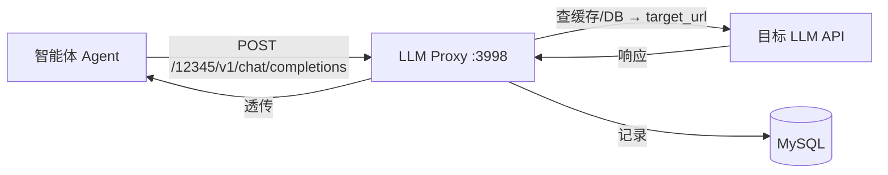

| 特性 | 实现 |
|------|------|
| 编号 | 5 位随机数，系统分配，永不冲突 |
| 服务器 | 单进程 FastAPI + asyncio，一个端口处理千级并发 |
| 配置存储 | MySQL，所有状态持久化，内存缓存 + TTL 加速 |
| 安全 | JWT 认证 + bcrypt + SSRF 防护 + CORS |
| 转发协议 | HTTP/1.1 默认 + HTTP/2 按端口可选择 |
| 流式处理 | SpooledTemporaryFile 流内缓冲，流结束一次性写入 MySQL |

### 路由优先级

```
/api/*           → 管理接口（认证、端口 CRUD、历史查询）
/{port_number}/* → 共享代理端点（转发到目标 LLM API）
```

FastAPI 先注册 `/api/*` 路由，后注册 `/{port_number}/*`，确保管理接口优先匹配。

## 完整数据流

### 1. 用户注册

用户注册行为由环境变量 `REQUIRE_APPROVAL` 控制。默认 `false`（无需审批，注册后直接登录）。

**无需审批模式（REQUIRE_APPROVAL=false，默认）**

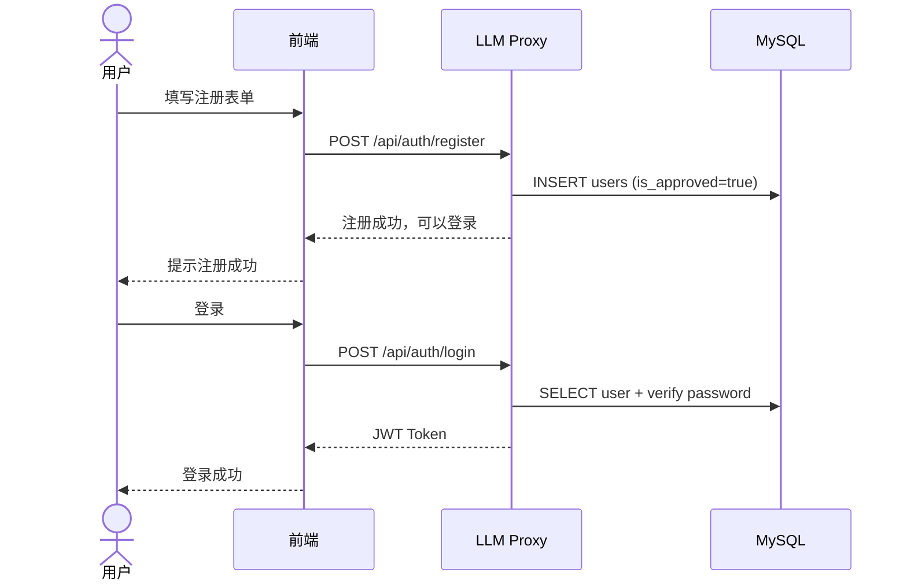

**需要审批模式（REQUIRE_APPROVAL=true）**

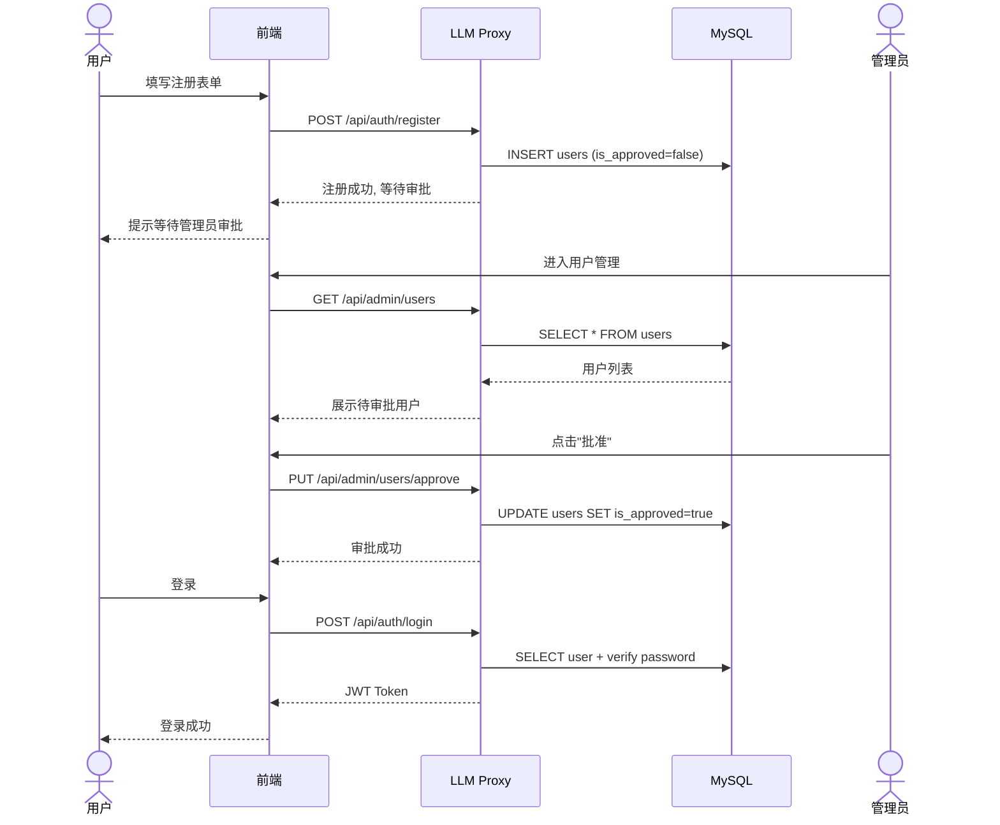

### 2. 代理创建

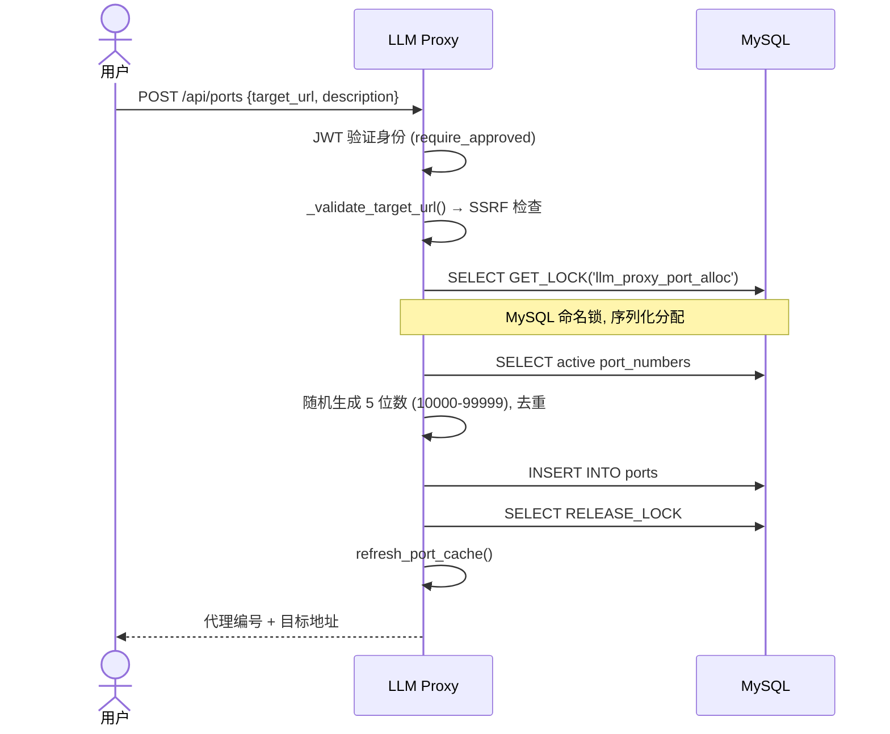

### 3. 代理转发（非流式）

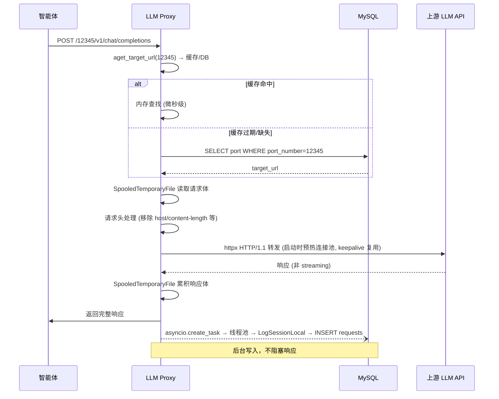

### 4. 代理转发（流式 SSE — SpooledTemporaryFile 架构）

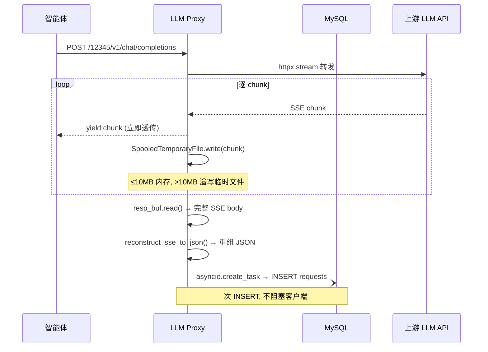

### 5. 数据入库（关键保证）

每条交互记录最终都进入 `requests` 表，含以下字段：

| 字段 | 非流式 | 流式 |
|------|:--:|:--:|
| `port_id` | port.id 或 NULL | port.id 或 NULL（端口删除后仍保存） |
| `prefer_http2` | port 配置 | 决定使用 HTTP/1.1 还是 HTTP/2 客户端转发 |
| `method` / `path` | ✅ | ✅ |
| `request_headers` / `request_body` | ✅ | ✅ |
| `response_headers` | ✅ | ✅ |
| `response_body` | JSON | 重建 JSON（失败时回退为原始文本） |
| `response_body_raw` | 同 response_body | 完整原始 SSE 文本 |
| `status_code` | ✅ | ✅ |
| `duration_ms` | ✅ | ✅ |
| `reconstruction_error` | 始终 False | True = 重建失败（前端展示警告） |

数据不丢失保证：

- 端口被删除 → 记录仍写入，`port_id=NULL`
- SSE 重建失败 → `response_body_raw` 保留原始数据，`reconstruction_error=True`
- DB 写入失败 → 3 次重试

### 6. 代理端口生命周期

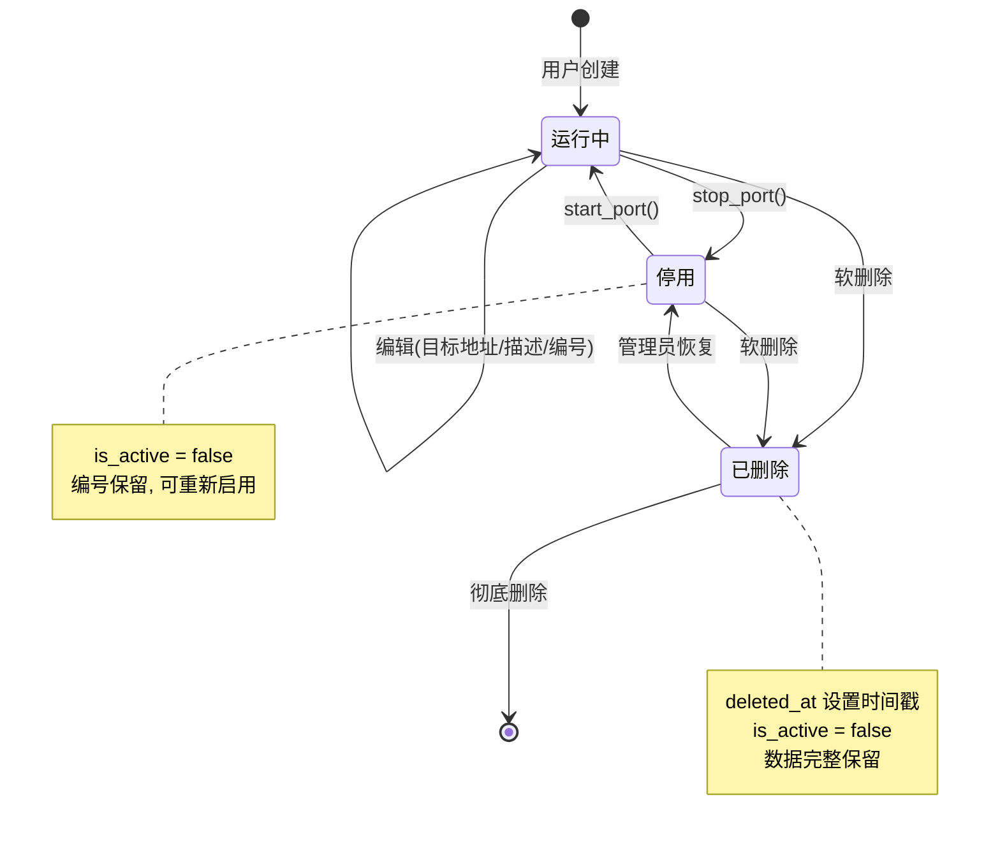

**软删除机制**：删除端口时仅设置 `deleted_at` 时间戳和 `is_active=False`，不删除数据库记录。管理员可在「已删除代理」页面查看、恢复或彻底删除。软删除期间产生的交互记录仍写入 `requests` 表（`port_id=NULL`），数据不会丢失。

**停用 vs 软删除**：停用只是 `is_active=False`，代理编号保留且可重新启用。软删除后代理从缓存移除，编号不可再用。

## 数据模型

```
users                        ports                              requests
┌──────────────┐            ┌─────────────────────────┐        ┌──────────────────────┐
│ id (PK)      │──┐         │ id (PK)                 │──┐     │ id (PK)              │
│ username     │  │         │ port_number (UQ)        │  │     │ port_id (FK→ports)   │
│ password_hash│  │ 1:N     │ user_id (FK)            │←─┘     │ method               │
│ role         │──┘         │ target_url              │ 1:N    │ path                 │
│ is_approved  │            │ description             │────────│ request_headers      │
│ created_at   │            │ is_active               │        │ request_body         │
└──────────────┘            │ prefer_http2            │        │ response_headers     │
                            │ deleted_at              │        │ response_body        │
                            │ created_at              │        │ response_body_raw    │
                            └─────────────────────────┘        │ status_code          │
                                                               │ duration_ms          │
                                                               │ reconstruction_error │
                                                               │ created_at           │
                                                               └──────────────────────┘
```

## 安全设计

| 层面 | 措施 | 实现 |
|------|------|------|
| 身份认证 | JWT (HS256) | Bearer Token，7 天过期 |
| 密码存储 | bcrypt | 72 字节截断 + 随机盐 |
| 用户审批 | REQUIRE_APPROVAL 环境变量控制 | 设为 true 时新用户注册后需管理员审批；默认 false，无需审批 |
| 权限控制 | role (admin/user) | 依赖注入 require_admin / require_approved |
| SSRF 防护 | URL 校验 | 阻止内网 IP / localhost / metadata 端点 |
| CORS | FastAPI Middleware | 可配置来源白名单 |
| 端口分配锁 | MySQL GET_LOCK | 序列化分配，防止编号冲突 |
| API Key | 透传不存储 | 代理不记录 Authorization 头 |

## 高并发设计

### 瓶颈分析与缓解

| 瓶颈点 | 方案 | 参数 |
|--------|------|------|
| 事件循环阻塞 | 所有 DB 查询在线程池执行 | `run_in_executor(_db_executor)` |
| 管理接口 vs 日志争抢 | 双 DB 连接池完全隔离 | 管理池 20+40 / 日志池 10+20 |
| 线程池争抢 | 代理日志使用专用线程池 | `DB_SAVE_WORKERS=8` |
| 上游连接数 | httpx 双客户端（热启动）| HTTP/1.1 (默认) + HTTP/2 (按端口可选), 连接无上限 |
| 端口查找 | 内存缓存 + TTL | 5 秒过期，缓存命中率 99.9%+ |
| 请求体 OOM | SpooledTemporaryFile | ≤10MB 内存，>10MB 溢写磁盘 |
| 流式内存累积 | SpooledTemporaryFile | ≤10MB 内存, >10MB 自动溢写临时文件 |
| 流式重建 | 流结束后立即同步重组 | 无需后台 Worker, 即写即见 |
| HTTP/1.1 keepalive | 连接池预热 + 自动重试 | 无 GOAWAY，流式稳定不中断 |

### 为什么不需要多进程

| 原因 | 说明 |
|------|------|
| I/O 密集型 | 代理转发 90%+ 时间在 await（等待网络），CPU 利用率 <5% |
| asyncio 协程 | 单线程调度数千协程，每个协程切换开销微秒级 |
| 阻塞操作已隔离 | DB 写入、SSE 解析全部放到专用线程池 |
| 真正瓶颈在上游 | OpenAI 的生成速度（秒级）远超代理转发开销（微秒级） |

如需高可用，应使用多容器 + 负载均衡，而非单机多进程。

## SSE 流式处理（SpooledTemporaryFile 架构）

### 格式支持

| API | 检测标志 | 解析方式 |
|-----|----------|----------|
| OpenAI Chat Completions | `choices[].delta` | 逐 chunk 累积 content + tool_calls |
| OpenAI Responses | `type` 以 `response.` 开头 | 按事件类型累积 output_text / reasoning |
| Anthropic Messages | `type` 为已知事件名 | 按 content_block 索引累积 text / thinking / tool_use |
| Google Gemini | `candidates[]` 存在 | 累积 parts[].text |
| 通用/未知 | 以上均不匹配 | 深度合并 + content 字段提取 + 递归遍历 |

### 流内缓冲

每个流式请求创建一个独立的 `SpooledTemporaryFile` 对象：

```
async for chunk in response.aiter_bytes():
    yield chunk                        # ① 立即发给客户端
    resp_buf.write(chunk)              # ② 写入缓冲区

# 流结束
resp_buf.seek(0)
full_body = resp_buf.read()           # ③ 读出完整 SSE
reconstructed = _reconstruct_sse_to_json(full_body)  # ④ 重组 JSON
asyncio.create_task(_save_record_async(...))          # ⑤ 一次性写入 requests
```

**为什么不在流进行中写 MySQL？**

每个 SSE 流可能产生数百到数千个 chunk，每个 chunk 几十到几百字节。逐 chunk INSERT 会产生大量数据库写入（redo log、undo log、binlog、索引维护），对 MySQL 造成不必要的压力。SpooledTemporaryFile 在流中进行零 I/O（内存模式），流结束后一次性写入 —— 从 N 次 INSERT 降为 1 次。

**溢出到磁盘**

SpooledTemporaryFile 在小于 `PROXY_BODY_MEMORY_LIMIT`（默认 10 MB）时完全在内存中操作。超过上限时自动透明地溢出到磁盘临时文件。LLM API 的响应通常远小于 10 MB，因此绝大多数流不会触及磁盘。

### 数据库连接池设计

整个系统使用 **三套独立的 SQLAlchemy 连接池**：

```
┌─ engine (DB_POOL_SIZE=20, DB_MAX_OVERFLOW=40)
│   连接同一个 MySQL
│   用途：FastAPI 管理路由 → 用户登录、端口 CRUD、历史查询
│   调用方：浏览器触发的 /api/* 请求
│
├─ _log_engine (DB_LOG_POOL_SIZE=10, DB_LOG_MAX_OVERFLOW=20)
│   连接同一个 MySQL
│   用途：代理日志写入 → 写 requests
│   调用方：代理转发线程
│
└─ _stream_engine (pool_size=5, max_overflow=5)
    连接同一个 MySQL
    用途：大数据量流式查询 → 端口历史导出
    特性：pymysql SSCursor (server-side cursor)，逐批拉取行，不一次性加载到内存
    调用方：导出接口 GET /api/ports/{id}/export
```

**为什么要三套？**

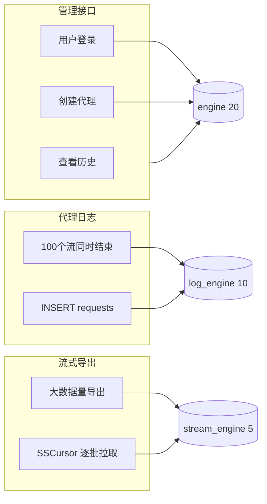

如果共用一套连接池，100 个 SSE 流同时结束的瞬间——每个流一次 `INSERT requests`——可能暂时耗尽池中连接。此时管理员尝试登录，发现**无连接可用**，只能排队等 30 秒超时。三套池完全隔离后，日志写入再繁忙，管理接口始终有 20 个空闲连接待命。

流式导出使用第三套池，原因是 **pymysql SSCursor 的约束**：SSCursor 在读取完所有行之前不能在同一连接上执行其他查询。如果导出使用了管理池的连接，可能导致其他请求无法读取数据。独立小池（5+5）确保导出不阻塞其他操作。

**日志专用线程池**

代理日志写入（`_save_to_db`）使用 `database._db_executor`（`DB_SAVE_WORKERS=8` 个线程），而非 asyncio 的默认线程池。这样日志写入任务之间互不争抢，且不会占满 asyncio 默认线程池影响其他操作。

### 大数据量导出：端到端流式架构

端口交互历史导出（`GET /api/ports/{id}/export`）面临的核心挑战是：一个端口可能积累数万条记录，每行包含 LONGTEXT 字段。传统做法（后端全量查询 → 内存组装 → 一次性返回 → 前端解析）在数据量大时必然超时或 OOM。

本系统的导出采用**五层真流式 + 浏览器原生下载**——用户点击导出，浏览器**立即弹出下载对话框**，自带进度条。数据从 MySQL 直接流到用户硬盘，全程不经过 JavaScript 内存缓冲，也不受任何超时限制。

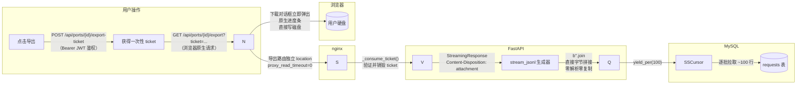

#### 各层关键设计

| 层 | 技术选型 | 为什么 | 超时 |
|---|---|---|---|
| MySQL → Python | `pymysql.cursors.SSCursor` | 服务端游标，不在 MySQL 客户端缓冲全部行 | `read_timeout=300s`（每批是 100 行小查询） |
| Python 行处理 | `b"".join(parts)` 直接构建 JSON 字节 | **不** json.loads() / json.dumps() — LONGTEXT 字段已是有效 JSON，首字符检查后原样嵌入，零解析零复制 | 每行 ~微秒级 |
| Python → FastAPI | `StreamingResponse` + `yield_per(100)` | 读取一批立即发送一批，内存同时只有 ~100 行 | 无 (uvicorn 不限时) |
| nginx | 导出路由独立 `location` 块 | 专用路由不限时，不影响其他 API | `proxy_read_timeout=0`（不限时） |
| 浏览器 | `<a>` 标签导航 + `Content-Disposition: attachment` | 浏览器原生下载管理器，弹出对话框即开始写磁盘，JS 内存占用为 0 | 无 (浏览器默认不限时) |

#### 一次性 Ticket 鉴权

核心矛盾：浏览器 `<a>` 标签下载**无法携带自定义 HTTP 头**（如 `Authorization: Bearer ...`），但直接把 JWT 放在 URL 查询参数里会泄露到 nginx 日志、浏览器历史、Referer 头。

解决：引入**一次性下载 ticket**——前端通过 Bearer 鉴权的 API 获取一个随机字符串，然后把它放在下载 URL 中。Ticket 是：

- **单次使用**：验证后立即销毁（`dict.pop`），同一个 ticket 第二次请求直接 401
- **60 秒过期**：指拿到 ticket 后必须在 60 秒内**开始下载**，与下载耗时无关——ticket 在 HTTP 请求到达的瞬间就被验证并销毁了，后续几小时的流式传输完全不受影响
- **内存存储**：不落库，进程重启后全部作废
- **端口绑定**：ticket 记录了 `port_id`，不能跨端口使用

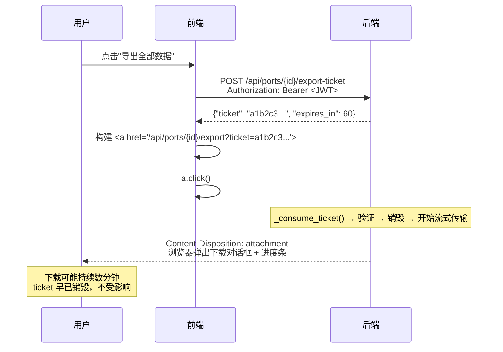

#### 两条导出路径

```
导出方式          all / api 过滤器                    other 过滤器
─────────────────  ─────────────────────────────────  ──────────────────────
数据路径           浏览器原生下载（ticket → 流式）       前端已加载分页数据导出
处理              后端 SSCursor 逐批 → 浏览器写磁盘     前端 Blob → 下载
API 调用            POST /export-ticket + GET /export   无 API 调用
内存占用            浏览器 JS ~O(1)                     浏览器 JS O(n)
格式              后端 Content-Disposition 含时间戳文件名 前端生成文件名
```

`all` 和 `api` 过滤器走浏览器原生下载。`other`（非 API 方法）过滤器后端不支持，从前端已加载的分页数据导出。

#### format=simple 模式

导出 API 支持 `?format=simple` 参数。默认 `full` 模式返回完整的 `{port, total_requests, requests: [{id, method, path, request_headers, ...}]}`；`simple` 模式返回扁平数组 `[{index, method, path, status_code, request, response}]`，由后端完成 JSON 提取和重组，前端零处理开销。"导出全部 API 请求 JSON"按钮即使用此模式。

#### 每行处理性能：零解析 vs json.loads+dumps

导出最耗 CPU 的环节不是数据库查询，而是**每行数据的 Python JSON 处理**。一个端口 1 万条记录、每条 4 个 LONGTEXT 字段（请求/响应 header+body），平均 50KB 的 body 意味着一共 **2GB 文本需要处理**。

旧方案（每行的典型写法）：

```
MySQL LONGTEXT (已是有效 JSON 字符串)
  → json.loads(50KB) → Python dict/list 树 (数千个对象)
  → json.dumps(200KB 全行) → JSON 字符串
  → encode("utf-8") → bytes
  → GC 回收临时对象树
  # 合计：4 万次 json.loads + 1 万次 json.dumps
```

本系统的做法：

```
MySQL LONGTEXT  →  raw[0] 第一个字符检查  →  原样嵌入输出  →  b"".join(parts)
                    单字符操作 (纳秒)           零复制          一次内存分配
```

**为什么可以原样嵌入？** LLM API 的请求体和响应体**永远是 JSON**（OpenAI/Anthropic/Google 的 API 都只接受/返回 JSON）。MySQL 里存的 `request_body` / `response_body` 字段已经是合法的 JSON 字符串，不需要重新解析再序列化。首字符检查（`{` ` [` `"` `t` `f` `n` `-` 数字）是对 JSON 结构的廉价验证，在极端罕见情况下遇到非 JSON 内容（如表单数据）时回退到 `json.dumps`。

| 指标 | 旧方案 (json.loads+dumps) | 新方案 (字节拼接) |
|------|--------------------------|-------------------|
| 每行处理 | `json.loads(4×body)` + `json.dumps(全行)` | `raw[0]` 检查 + `b"".join` |
| body 文本复制 | 2 次（parse 分配对象 → serialize 生成字符串） | 0 次（原样嵌入） |
| Python 对象分配 | 每行数千个 dict/list/str/int | 每行 1 个 bytes |
| 1 万行 50KB body 耗时 | ~30-120 秒（Python CPU bound） | ~1-3 秒 |
| 内存峰值 | Python 对象树递归分配 | ~100 行 × 各字段字节片段 |

#### 为什么不用 axios / fetch

| 方案 | 下载对话框 | 进度条 | 内存占用 | 超时风险 |
|------|:--:|:--:|:--:|:--:|
| axios `r.data` | ❌ 等全部传完才弹 | ❌ 无 | 全部数据在 JS 堆里 | 30s 硬超时 |
| fetch `r.blob()` | ❌ 等全部传完才弹 | ❌ 无 | 全部数据在 JS 堆里 | 无（但不写磁盘） |
| **`<a>` 标签 + 一次性 ticket** | ✅ 立即弹出 | ✅ 原生进度条 | 0（浏览器直接写磁盘） | 无 |

核心洞察：**浏览器自带一个完善的下载管理器，为什么要绕过它？**

### 请求头转发规则

代理转发到上游 LLM API 时，以下请求头会被**移除**：

| 移除的头 | 原因 |
|----------|------|
| `host` | 替换为目标 API 的 host（如 `api.openai.com`） |
| `content-length` | httpx 自动计算，手动传递可能不匹配 |
| `connection` | httpx 自行管理 keep-alive |
| `transfer-encoding` | httpx 自行处理分块传输 |
| `content-encoding` | httpx 自动解压响应，无需透传 |
| `accept-encoding` | 显式移除，避免上游返回压缩内容 |

`Authorization` 头（API Key）**原样透传**，代理不存储也不修改。

### HTTP 协议选择：HTTP/1.1 vs HTTP/2

每个代理端口可以独立选择转发协议，创建和编辑时在弹窗中配置。系统维护两个独立的 httpx 客户端池（HTTP/1.1 和 HTTP/2），请求到达时根据端口配置自动路由。

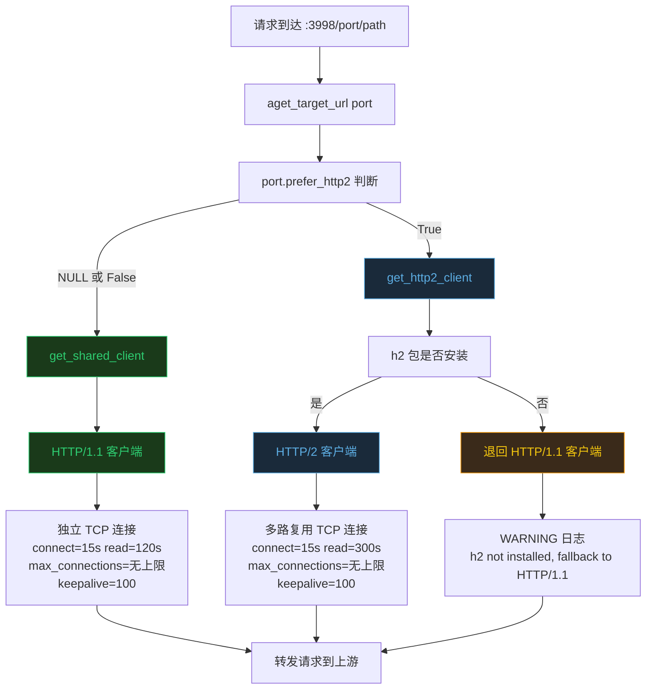

#### 对比

| | HTTP/1.1（默认，推荐） | HTTP/2（按需启用） |
|---|---|---|
| 连接模型 | 1 请求 = 1 TCP 连接 | 多请求复用 1 条 TCP 连接（多路复用） |
| 首次建连 | TLS 握手 ~50ms（有 keepalive 复用） | TLS 握手 ~50ms（多路复用后零开销） |
| **流中断风险** | **无**——上游只能在响应完成后关闭连接 | **存在**——上游回收连接时 GOAWAY 帧会同时断开该连接上所有正在传输的流 |
| 故障影响面 | 只影响 1 个请求 | 影响该连接上所有复用的请求（可多达几十个） |
| 并发能力 | 连接数无上限（操作系统 ulimit 决定） | 少数连接承载大量请求 |
| 适用场景 | 中转站、代理、长连接 SSE 流 | 直连 OpenAI/Anthropic 等不会激进回收连接的 API |

#### 为什么默认 HTTP/1.1

LLM API 的请求几乎全部是流式 SSE，每个响应持续数秒到数分钟。这不是"高并发短请求"的网页浏览场景，而是**长连接稳定性**场景。

**核心问题：中转站会主动关闭 HTTP/2 连接**

中转站（如 dmxapi.cn）同时服务成百上千个客户端，必须严格控制服务器资源。HTTP/2 的每个连接需要维护流状态（stream state），消耗内存和 CPU，因此中转站会设置较短的连接空闲超时（通常 30-60 秒），到期就发 GOAWAY 帧关闭连接：

```
HTTP/2 的致命场景：

  代理 ──HTTP/2──→ 中转站
  一条 TCP 连接上复用了 50 个用户的 SSE 流
       │
       ├── 用户A 的 SSE 流 (已传输 20 秒, 还剩 10 秒)
       ├── 用户B 的 SSE 流 (已传输 5 秒, 还剩 20 秒)
       └── ...
       │
       中转站："这个连接太老了，关掉" → GOAWAY → TCP RST
       │
       └── 50 个用户同时看到回复中断 ❌
           （数据已发给最终客户端，无法重试）

HTTP/1.1 无此问题：

  代理 ──HTTP/1.1──→ 中转站
  TCP连接1 → 用户A (独立, 30s 流完成后才释放)
  TCP连接2 → 用户B (独立, 25s 流完成后才释放)
  ...
  中转站回收连接1 → 只影响用户A ✅
  其余 49 个用户完全无感知 ✅
```

**换句话说**：HTTP/2 的"多路复用"在网页浏览、微服务调用中是巨大优势（省连接、低延迟）。但在 LLM 流式代理 + 中转站的场景下，它把 50 个用户拴在同一根绳子上——中转站为了资源管理剪断绳子，50 个人一起摔。

**瓶颈不在建连速度（50ms 的 TLS 握手 vs 30 秒的流式输出可忽略），而在传输稳定性。**

#### 什么时候选 HTTP/2

直连 OpenAI / Anthropic / Google 等一线模型 API 时，这些 API 知道客户端在做 LLM 推理，连接超时设得很宽松，**不会在流中途发 GOAWAY**。此时 HTTP/2 的多路复用可以在同一连接上并发多个请求，减少 TLS 握手次数。

**简单判断：目标是中转站 → HTTP/1.1，目标是模型厂商直连 API → HTTP/2。**

#### 连接复用（keepalive）

两种协议都支持连接池。一条 TCP 连接在上一个请求完成后回到池中保持温热，后续请求直接复用，省去 TLS 握手。配置：并发连接数不设上限（由操作系统 ulimit 决定），keepalive=100。

#### 重试策略与稳定性设计

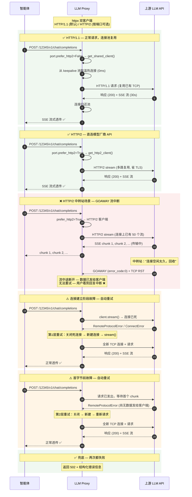

| 层次 | 错误位置 | 行为 |
|------|----------|------|
| 第1层 | `stream()` / `__aenter__()` | 静默重试一次 |
| 第2层 | `aiter_bytes()` 首字节前 | 关闭死连接，新建连接，静默重试 |
| 第2层 | `aiter_bytes()` 数据已发 | 优雅终止流，日志 warning |
| 兜底 | 两次都失败 | 返回 502 + 结构化错误信息 |

关键日志（`INFO` 级别）记录在 `llm_proxy.proxy` logger 下：

```
2026-06-08 14:30:16 [INFO] llm_proxy.proxy: Retrying stream setup (attempt 2/2) — connection may be dead: ConnectError: ...
```

### 编码清洗（Surrogate 字符处理）

智能体发送的请求体或上游 API 的响应体中可能包含非法 UTF-8 字节（如 lone surrogate 字符 `U+D800–U+DFFF`）。这些字符在 Unicode 标准中是为 UTF-16 内部使用保留的，无法被 MySQL 的 `utf8mb4` 编码接受。

**自动清洗机制**（`_sanitize_text`）：

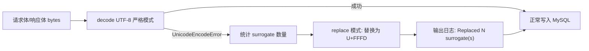

**生效范围**：所有写入 MySQL `LONGTEXT` 列的文本字段——`request_headers`、`request_body`、`response_headers`、`response_body`、`response_body_raw`。

**日志示例**：
```
[Proxy] WARNING: request body contains surrogate characters after JSON serialization — sanitizing
[Sanitize] Replaced 1 surrogate(s), 1898074 → 1898074 chars
```

清洗后的数据前端可正常展示，非法字符位置显示为 ``。

## 部署方式

### 开发模式

#### 前置条件

- Python 3.14（推荐 `conda activate py314`）
- Node.js 18+
- MySQL 8.0+（远端或本地均可）

#### 1. 克隆项目

```bash
git clone https://github.com/HaoCheng-Wang/llm-proxy.git
cd llm-proxy
```

#### 2. 配置环境变量

```bash
cp .env.example .env
vim .env
```

所有配置项的详细说明见 `.env.example` 中的注释。

> 数据库和表会在后端首次启动时自动创建。

#### 3. 安装后端依赖

选择以下任一方式：

**方式 A：用自己的 Python 3.14 环境（conda）**

```bash
conda activate py314
pip install -r backend/requirements.txt
```

**方式 B：用 uv 创建隔离的虚拟环境**

```bash
# uv 会自动下载或复用你已有的 Python 3.14
#   Linux/macOS: curl -LsSf https://astral.sh/uv/install.sh | sh
#   Windows:     powershell -c "irm https://astral.sh/uv/install.ps1 | iex"
uv sync
```

> `uv sync` 在项目根目录创建 `.venv/`，里面包含所有依赖。

#### 4. 启动后端（终端 1）

```bash
# 方式 A（conda 环境）
nohup python backend/main.py > back.log 2>&1 & echo $! > back.pid

# 方式 B（uv 环境）
nohup uv run python backend/main.py > back.log 2>&1 & echo $! > back.pid
```

> 后端以后台方式运行，日志输出到 `back.log`。查看日志：`tail -f back.log`，停止：`kill $(cat back.pid)`

输出示例：
```
[Main] Running schema setup...
[DB] Database 'llm_proxy' is ready
[DB] All tables verified
[DB] Schema setup complete (DDL engine disposed)
[DB] Engine ready (pool_size=20, max_overflow=40)
  Created admin user: admin
[Main] Management API + Shared Proxy ready on port 3998
```

#### 5. 启动前端（终端 2）

```bash
cd frontend
npm install
npm run dev
```

前端 Vite 开发服务器自动代理 `/api` 到 `localhost:3998`，监听 `0.0.0.0:3999`。

> 如需修改前端绑定的 IP 或端口，编辑 `frontend/vite.config.js` 中的 `host` / `port` 字段即可。

#### 6. 访问

打开浏览器，按你的环境选择：

- 本机访问：**http://localhost:3999**
- 局域网访问：**http://<你的IP>:3999**（如 `http://192.168.2.105:3999`）

管理员账号：`.env` 中设置的 `DEFAULT_ADMIN_USERNAME` / `DEFAULT_ADMIN_PASSWORD`。

#### 7. 使用流程

1. 用户注册账号并登录（`REQUIRE_APPROVAL=false` 时注册后直接登录；设为 `true` 则由管理员审批后登录）
2. 用户登录 → 点击「创建代理」→ 输入目标 API 地址并**选择转发协议**（默认 HTTP/1.1，中转站场景推荐；直连模型 API 可选 HTTP/2）
3. 在智能体中，把 API Base URL 改为 `http://<你的IP>:3998/<分配的端口号>`，路径部分保持不变：
   - 原来：`https://api.openai.com/v1/chat/completions`
   - 改为：`http://<IP>:3998/12345/v1/chat/completions`（`12345` 为系统分配的 5 位编号）
   - API Key 等其他配置不需要任何修改
4. 在「查看详情」页面实时查看所有交互记录

### Docker 生产部署

两个容器：`backend`（Python）+ `frontend`（nginx）。MySQL 需自行部署。

#### 前置条件

- Docker 24+
- MySQL 已运行（可达的地址）

#### 1. 准备

```bash
git clone https://github.com/HaoCheng-Wang/llm-proxy.git
cd llm-proxy
cp .env.example .env
vim .env
```

#### 2. 构建并启动

```bash
docker compose build
docker compose up -d
```

#### 3. 查看状态

```bash
docker compose ps
docker compose logs -f    # 实时日志
```

#### 4. 停止

```bash
docker compose down
```

#### docker-compose.yml 结构

```yaml
services:
  backend:              # Python FastAPI + 共享代理
    network_mode: host  # 只需监听 :3998 一个端口
    volumes:
      - ./.env:/app/.env:ro  # 挂载配置文件

  frontend:             # nginx + Vue 静态文件（容器内自动构建）
    network_mode: host
    volumes:
      - ./nginx.conf:/etc/nginx/conf.d/default.conf:ro
```

> 后端只需监听一个端口（默认 3998）。前端在 Docker 构建阶段自动编译，无需本地安装 Node.js。

### 多机水平扩展

当单机连接数或 CPU 不足时，可部署多台代理实例，前面加 Nginx 负载均衡。

#### 架构

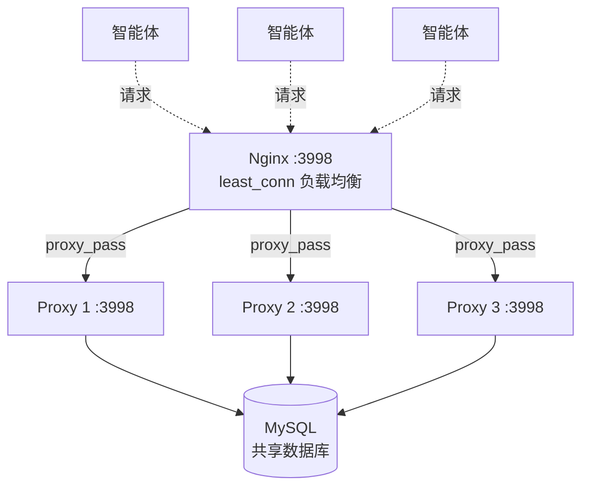

#### 必备条件

- MySQL 独立部署，所有代理实例连接同一个库
- 所有实例的 `.env` 中 `SECRET_KEY` **必须完全一致**（共享 JWT）
- `DATABASE_HOST` 指向同一台 MySQL

#### 配置步骤

**1. 每台机器部署代理实例**

```bash
git clone https://github.com/HaoCheng-Wang/llm-proxy.git
cd llm-proxy
cp .env.example .env
vim .env   # 设置 DATABASE_HOST、SECRET_KEY 等
docker compose up -d
```

**2. 配置 Nginx 负载均衡**

```nginx
upstream llm_proxy_backend {
    # 轮询模式，可改为 least_conn 优先分给连接最少的实例
    server 192.168.1.10:3998;
    server 192.168.1.11:3998;
    server 192.168.1.12:3998;
}

server {
    listen 3998;
    location / {
        proxy_pass http://llm_proxy_backend;
        proxy_http_version 1.1;
        proxy_set_header Connection "";
        proxy_set_header Host $host;
        proxy_set_header X-Real-IP $remote_addr;
        proxy_read_timeout 300s;   # 匹配 SSE 长连接
    }
}
```

**3. 前端指向 Nginx**

修改 `frontend/vite.config.js`（开发）或 `nginx.conf`（生产）中的 API 代理目标为 Nginx 地址。

#### 多机安全机制

| 机制 | 实现 |
|------|------|
| 端口分配互斥 | `SELECT GET_LOCK('llm_proxy_port_alloc', 10)` — MySQL 服务端命名锁 |
| 端口缓存 | 每实例独立内存缓存，TTL 各自到期刷新，最终一致 |

#### 单机 vs 多机参数建议

| 参数 | 单机（默认） | 3 台 × 多机 |
|------|:--:|:--:|
| `HTTPX_MAX_KEEPALIVE_CONNECTIONS` | 100 | 每台 keepalive 连接数 |
| `DB_POOL_SIZE` | 20 | 10（每台，总 30） |
| `DB_LOG_POOL_SIZE` | 10 | 8（每台，总 24） |
| `DB_SAVE_WORKERS` | 8 | 8（每台） |
| MySQL `max_connections` | 100 | 200+ |

> 多机部署时降低每台的 DB 连接池，避免总连接数超出 MySQL 上限。总 DB 连接 ≈ 台数 × (DB_POOL_SIZE + DB_LOG_POOL_SIZE)。

## 项目结构

```
llm-proxy/
├── .env.example             # 环境变量模板
├── Dockerfile               # 后端镜像
├── Dockerfile.frontend      # 前端构建 + nginx
├── docker-compose.yml       # 2 容器编排
├── nginx.conf               # 前端 nginx 配置
├── pyproject.toml           # uv 项目定义 + Python 依赖声明 + pytest 配置
├── test_backend.py           # 77 个单元测试（配置 / Auth / SSE 解析器 / 模型等）
├── test_integration.py       # 23 个集成+压力测试（端点逻辑 / 并发 / 大数据量）
├── README.md
│
├── backend/                 # Python FastAPI 后端
│   ├── main.py              # 入口：启动 FastAPI + 注册路由 + lifespan
│   ├── config.py            # 读取 .env 环境变量
│   ├── database.py          # 自动建库建表 + 三连接池（管理/日志/流式导出）+ 迁移
│   ├── models.py            # ORM 模型（User / Port / Request）
│   ├── schemas.py           # Pydantic 请求/响应模型
│   ├── auth.py              # JWT 认证 + bcrypt 密码哈希
│   ├── proxy_app.py         # 代理核心：HTTP/1.1 + HTTP/2 双客户端、SSE 解析、DB 记录
│   ├── shared_proxy.py      # 共享代理端点 /{port_number}/{path}
│   ├── proxy_manager.py     # 端口配置查询 + 缓存刷新
│   ├── requirements.txt     # pip 依赖
│   └── routers/
│       ├── auth_router.py   # 注册/登录/用户信息/修改密码
│       ├── admin_router.py  # 用户审批 + 已删除端口管理
│       ├── ports_router.py  # 端口 CRUD + 软删除 + 停用/启用 + 历史查询 + 流式导出
│       └── config_router.py # 前端配置（display_ip）
│
└── frontend/                # Vue 3 前端
    ├── index.html
    ├── package.json
    ├── vite.config.js
    └── src/
        ├── main.js          # Vue 入口
        ├── App.vue          # 根组件（导航栏 + toast）
        ├── style.css        # 全局样式
        ├── api/index.js     # axios 封装 + fetch 流式导出 + 拦截器
        ├── stores/auth.js   # Pinia 认证状态
        ├── router/index.js  # 路由配置 + 守卫
        ├── components/
        │   └── JsonTree.vue # JSON 树形查看组件
        └── views/
            ├── Login.vue          # 登录页
            ├── Register.vue       # 注册页
            ├── Dashboard.vue     # 代理列表 + 创建
            ├── PortDetail.vue    # 代理详情 + 交互记录 + 流式导出
            ├── JsonTreeViewer.vue # JSON 树形查看器
            ├── Admin.vue         # 用户管理
            ├── DeletedPorts.vue  # 已删除代理管理
            └── ChangePassword.vue # 修改密码
```

## 前端功能

| 功能 | 实现 |
|------|------|
| 实时刷新 | 端口详情页每 2 秒轮询 `GET /api/ports/{id}?since_id=N`，仅拉取新记录 |
| 交互筛选 | 按请求方法分类：`📤 API请求`（POST/PUT/PATCH/DELETE）vs `🌐 其他`（GET/OPTIONS/HEAD） |
| JSON 树形查看 | 基于 `vue-json-pretty`，请求和响应 JSON 各有独立树形查看按钮，支持折叠/展开/搜索 |
| 重建异常审查 | 当 `reconstruction_error=True` 时显示橙色警告横幅，提供"查看完整 SSE 原始文本"按钮 |
| 一键导出 | 三合一：JSON 数据导出 / **流式全量导出**（fetch + Blob 直通，零 JSON 解析，无超时限制）/ 后端全量 API 请求导出 |
| 分页加载 | 首次加载 10 条，支持"加载更多"和"加载全部"，上限 100 条/次 |
| 滚动保护 | 阅读交互记录时新数据到达不跳动滚动位置 |

## API 接口

### 通用

| 方法 | 路径 | 说明 |
|------|------|------|
| GET | `/api/health` | 健康检查 |

### 认证

| 方法 | 路径 | 说明 |
|------|------|------|
| POST | `/api/auth/register` | 注册（审批行为由 REQUIRE_APPROVAL 控制） |
| POST | `/api/auth/login` | 登录，返回 JWT |
| GET | `/api/auth/me` | 当前用户信息 |
| POST | `/api/auth/change-password` | 修改密码 |

### 代理管理

| 方法 | 路径 | 说明 |
|------|------|------|
| POST | `/api/ports` | 创建代理（自动分配编号） |
| GET | `/api/ports` | 列出我的代理（管理员看全部） |
| GET | `/api/ports/{id}` | 代理详情 + 交互历史（流式 NDJSON，分页） |
| PUT | `/api/ports/{id}` | 编辑代理（含转发协议） |
| DELETE | `/api/ports/{id}` | 软删除（可恢复） |
| POST | `/api/ports/{id}/stop` | 停用 |
| POST | `/api/ports/{id}/start` | 启用 |
| DELETE | `/api/ports/{id}/history` | 清空历史 |
| DELETE | `/api/ports/{id}/history/{req_id}` | 删除单条记录 |
| GET | `/api/ports/{id}/history/{req_id}` | 获取单条记录详情 |
| GET | `/api/ports/{id}/history/{req_id}/raw-sse` | 按需获取原始 SSE 文本 |
| GET | `/api/ports/{id}/export` | 流式导出全部交互 JSON（SSCursor + StreamingResponse + Content-Disposition） |
| POST | `/api/ports/{id}/export-ticket` | 创建一次性下载 ticket（用于浏览器原生下载，JWT 不暴露在 URL 中） |

### 管理员

| 方法 | 路径 | 说明 |
|------|------|------|
| GET | `/api/admin/users` | 用户列表 |
| PUT | `/api/admin/users/approve` | 审批用户 |
| DELETE | `/api/admin/users/{id}` | 删除用户 |
| GET | `/api/admin/deleted-ports` | 已删除代理列表 |
| POST | `/api/admin/ports/{id}/restore` | 恢复代理 |
| DELETE | `/api/admin/ports/{id}/permanent` | 彻底删除 |

### 代理转发

| 方法 | 路径 | 说明 |
|------|------|------|
| 任意 | `/{port_number}/{path}` | 透明转发到目标 LLM API |

## 环境变量

> 完整参考 `.env.example`

| 变量 | 默认值 | 说明 |
|------|--------|------|
| `DATABASE_HOST` | localhost | MySQL 地址 |
| `DATABASE_PORT` | 3306 | MySQL 端口 |
| `DATABASE_USER` | root | 数据库用户 |
| `DATABASE_PASSWORD` | root | 数据库密码 |
| `DATABASE_NAME` | llm_proxy | 数据库名（自动创建） |
| `SECRET_KEY` | — | JWT 签名密钥（必填） |
| `API_PORT` | 3998 | 后端监听端口 |
| `DISPLAY_IP` | — | 前端展示的服务器 IP |
| `CORS_ORIGINS` | — | CORS 白名单（逗号分隔） |
| `DEFAULT_ADMIN_USERNAME` | admin | 默认管理员 |
| `DEFAULT_ADMIN_PASSWORD` | admin123 | 默认密码 |
| `ALLOW_INTERNAL_TARGETS` | true | 是否允许代理到内网 |
| `REQUIRE_APPROVAL` | false | 新用户注册是否需要管理员审批 |
| `DB_POOL_SIZE` | 20 | 管理接口连接池 |
| `DB_MAX_OVERFLOW` | 40 | 管理接口连接池溢出 |
| `DB_LOG_POOL_SIZE` | 10 | 日志专用连接池 |
| `DB_LOG_MAX_OVERFLOW` | 20 | 日志专用连接池溢出 |
| `DB_SAVE_WORKERS` | 8 | 代理日志写入线程数 |
| `PORT_CACHE_TTL` | 5 | 端口缓存刷新间隔（秒） |
| `HTTPX_MAX_KEEPALIVE_CONNECTIONS` | 100 | httpx keep-alive 空闲连接数 |
| `PROXY_BODY_MEMORY_LIMIT` | 10485760 | 请求/响应体内存缓冲上限（字节） |

## 生产环境安全建议

### HTTPS

默认 `nginx.conf` 仅监听 HTTP (3999)。生产环境**必须**启用 HTTPS，否则 JWT token 和密码以明文传输。

推荐使用 Let's Encrypt 免费证书 + Certbot 自动续期：

```bash
apt install certbot python3-certbot-nginx
certbot --nginx -d your-domain.com
```

或在 nginx 前面加一层反向代理（如 Cloudflare、Caddy）来处理 TLS。

### 修改默认密码

首次启动后请立即修改 `.env` 中的 `DEFAULT_ADMIN_PASSWORD`，并重启后端。

### SSRF 防护

系统默认允许代理目标指向任意地址（包括内网）。如需部署到公网，在 `.env` 中设置 `ALLOW_INTERNAL_TARGETS=false`。

## 许可证

本项目采用 AGPL-3.0 开源许可。使用此许可证时，你必须公开对源代码的修改、通过网络提供服务时向用户提供源代码、保留原始版权声明。

如需在闭源商业产品中使用，请联系作者获取商业许可：hcwang0025@163.com
